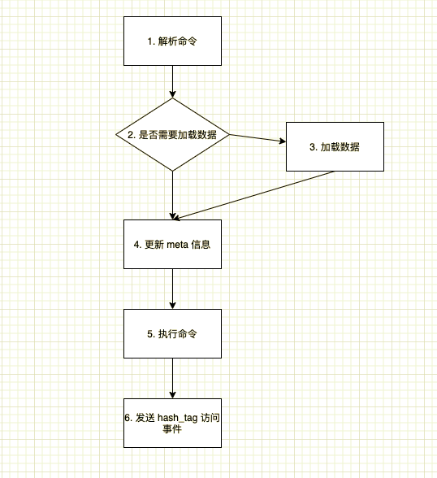

# room 架构设计文档

## 1. room 是什么

room 以 redis 的 [RESP 协议](https://redis.io/topics/protocol)对外提供数据存取服务，目前实现了单机版 redis (standalone redis) 6.0.x 版本支持的的大部分命令（[命令列表](commands.md))，不支持 redis cluster 模式以及 redis cluster 相关命令。

使用者可以把 room 看做是一个单机版的 redis，**目前 room 只对 bytepower_server 服务开放使用**。

### 1.1. room 要解决的问题

+  较低的访问延迟

   room 将活跃数据存放于内存中，保证活跃数据的访问延迟较低

+  较少的内存使用

   redis cluster 能够满足低延迟要求，但是 redis cluster 的数据都是存储在内存中的，随着数据量的增长，成本过高，而且不好扩展。room 提供了一种解决方案，只将最近访问的数据存放在 redis cluster 中，而将不再被访问的数据备份至关系型数据库中，在满足低延迟的业务场景的同时，减少了内存的使用。

目前 room 主要是满足 pigat 模块以及相关功能使用，对应读多写多的场景。


## 2. room 整体架构

room 服务分为三个部分: room_server 服务, room_collect_event 服务和 room_task，这 3 个部分以不同的进程进行部署。

这 3 部分实现的功能如下：

1. room_server 服务负责处理客户端的数据存取请求（如 set {abc}:def 100, get {mn}:a），最终将数据存储到 redis cluster 中
2. room_collect_event 服务负责将 room_server 收集到的 hash_tag （例子中的 abc, mn) 读写事件写入 PostgreSQL 数据库中，以供后续处理。读写事件信息包括：hash_tag，keys，访问模式，访问时间。
3. room_task 包含两个定时任务：sync_keys 和 clean_keys。sync_keys 任务根据 hash_tag 的写事件将 redis cluster 中的数据定时同步到 PostgreSQL 数据库中；clean_keys 任务根据 hash_tag 的读写事件将不经常访问的数据从 redis cluster 中清除，释放内存空间。

## 3. room 工作原理

### 3.1. room_server 服务的命令处理流程

room_server 服务使用 RESP 协议，接收客户端的请求，并给出响应，具体流程如下图：



命令处理流程图中的各个步骤的详细说明如下：

1. 根据 RESP 协议，解析客户端请求中的命令（如 set {abc}:def 100）
2. 判断命令中的 keys （{abc}:def） 是否需要从 PostgreSQL 数据库中加载，如果需要加载，进行步骤 3，否则进行步骤 4
3. 从 PostgreSQL 数据库中加载数据至 redis cluster 中
4. 更新 redis cluster 中 keys 所属 hash_tag（即例子中的 abc) 的 meta 信息（meta 信息文档稍后有说明）
5. 以 proxy 的方式执行命令，将命令转发至 redis cluster，redis cluster 执行命令并返回结果，room 将结果返回给客户端
6. 发送 hash_tag (例子中的 abc) 读写事件至 room_collect_event 服务，这一步是异步执行的，不影响对客户端的响应时间

#### 3.1.1. 如何判断 keys 是否需要从数据库中进行加载

下面进一步说明在流程的第 2 步中，如何判断命令中的 keys 是否需要从 PostgreSQL 数据库中加载。

room 为每个 hash_tag 维护了一个 meta 信息，以 hash 类型存储在 redis cluster 中，meta 中包含该 hash_tag 下 keys 的最近读写时间等信息。room 根据 meta 信息来判断是否需要从 PostgreSQL 数据库中加载数据：

1. 如果 meta 信息不存在，则表示该 hash_tag 的所有 keys 不在 redis cluster 中，即该 hash_tag 下的 keys 没有被访问过或由于一段时间没被访问而被 clean_keys 任务清理，需要从数据库中加载
2. 如果 meta 信息存在，则表示 hash_tag 下的 keys 已经存在于 redis cluster 中，且 redis cluster 中的是最新数据，不需要从 PostgreSQL 数据库中加载数据

### 3.2. room_colllect_event 服务处理 hash_tag 读写事件的流程

room_server 服务在处理命令时，会收集 hash_tag 的读写事件，事件记录了某 hash_tag 下的 keys 在什么时间被读写。事件经过去重合并后，发送给 room_collect_event 服务，room_collect_event 服务负责将这些事件写入数据库中。
这些事件在定时任务 sync_keys 和 clean_keys 中会用到。

### 3.3. room_task 后台任务处理流程

sync_keys 任务根据收集到的 hash_tag 写事件，将最近一段时间内有写事件的 hash_tag 下的所有 keys 由 redis cluster 同步到 PostgreSQL 数据库中，并将该 hash_tag 的同步状态由待同步(need_synced) 修改为已同步(synced)。
sync_keys 是周期性的异步后台任务，这意味 PostgreSQL 数据库中的数据不是实时的，这些数据只用于被清理的 keys 的数据加载或离线分析任务，线上业务需以 redis cluster 中的数据为准。

clean_keys 任务根据收集到的 hash_tag 读写事件，将一段时间内没有读写过的 hash_tag 下的所有 keys 从 redis cluster 中清除（包括该 hash_tag 的 meta 信息），以释放内存，并将数据库中 hash_tag 的同步状态由已同步(synced)修改为已清理(cleaned)。

## 4. 如何使用 room

存储到 room 中的 keys 必须要有 hash_tag，拥有相同 hash_tag 的所有 keys 最终会被存储到 redis cluster 的同一个 slot 上。这意味着同一个命令或事务中的 keys 都要有相同的 hash_tag，这样才能确保这些 keys 一定被分配到同一个 slot 上。

从业务层面上来说，目前 keys 的 hash_tag 为 user_id，这意味着同一 user 的数据才能在同一个事务里面进行处理。

目前 room 服务只对 bytepower_server 开放使用，使用时需要使用 bytepower_server 封装的 API （ShardResource.RoomWithModuleUser 方法），而不是直接使用 redis 客户端库。

bytepower_server 使用 room 的方法举例：

```
appID := "this_is_a_test_app_id"
userID := "this_is_user_id"
module := "account"
key := "abcd"

res := base.Resource(appID)
client := res.RoomWithModuleUser(module, userID)
client.Set(key, "value", 0)
```

使用通过 RoomWithModuleUser 方法获取的 Room Client 操作 key 时，key 有前缀 shorten_app_id:module:{user_id}:, 其中 shorten_app_id 指 appID 的后7位。如上面的例子中，最终操作的 key 是 _app_id:account:{this_is_user_id}:abcd。


## 5. FAQ

1. 为什么要兼容 redis？

   首先在设计 room 之前，已有一些业务场景中使用了 redis，这样这些业务由 redis 迁移到 room 时不需要做太多的工作；
   其次 redis 的数据类型、事务等适用于现在的业务场景，不需要重新进行设计；访问 room 的客户端库也可在已有的 redis 客户端库的基础上进行，不需要重新造轮子，这些都减少了工作量。
